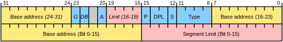

# gdt

보호모드는 사용자가 os의 메모리 공간을 막 다룰 수 있는 리얼모드와는 반대로 자체적인 메모리 보호 기능을 갖는 모드이다. 

리얼모드는 16비트로 다루게 되지만 보호모드를 이용하여 32bit 공간을 다룰 수 있다. 또 32bit 확장 레지스터를 다룰 수 있다. 

## gdt란?

[https://wisepine.tistory.com/18](https://wisepine.tistory.com/18)

세그먼트 영역에 대한 데이터를 일정 디스크립터 형식으로 기술한 것이다.

다음과 같은 구조로 이루어져 있다. 



- segment limit: 세그먼트 크기/한계 수치. 속성 비트 G에 따라 한계가 달라진다.
- base addr: 세그먼트의 물리 주소.
- P: 세그먼트와 메모리 존재 여부
- DPL: 커널 레벨 유저 레벨 여부
- S: 시스템 세그먼트 0, 코드 세그먼트 1
- Type: 권한
- G: 세그먼트 단위 설정. 0 바이트 단위, 1 4kb 단위
- D: default operation size. 0 16비트, 1 32비트
- AVL: 소프트웨어가 사용

예시 구현

```asm
gdt:
    dw 0
    dw 0
    db 0
    db 0
    db 0
    db 0

SysCodeSelector equ 0x8000 ; 코드 세그먼트 디스크립터
    dw 0xFFFF   ; seg lim
    dw 0x0000   ; base addr lower 0~15
    db 0x01     ; base addr upper 16~23
    db 0x9A     ; 속성 비트 (P, DPL, S, Type)
    db 0xCF     ; 속성 비트 (G, D, 0, AVL, 세그먼트 리밋)
    db 0x00     ; base addr upper 24~31
```

위를 요약한 예시로 다음과 같이 사용할 수 있다. 

```asm
gdt:
	dd 0,0 ; NULL 세그
	CodeSegment equ 0x08
	dd 0x0000FFFF, 0x00CF9A00 ; 코드 세그
	DataSegment equ 0x10
	dd 0x0000FFFF, 0x00CF9200 ; 데이터 세그
	VideoSegment equ 0x18
	dd 0x8000FFFF, 0x0040920B ; 비디오 세그
```

gdt를 구현했다면 이를 사용하겠다는 것을 시스템에 전달한다. 

```asm
lgdt[gdtr]
```

이후 인자로 전달하기 위한 요소를 작성한다. 

```asm
gdtr:
    dw gdt_end - gdt - 1
    dd gdt+0x7C00
```

## 세그먼트 셀렉터를 이용한 보호모드에서 주소 지정 방법

[https://itguava.tistory.com/14](https://itguava.tistory.com/14)

이해하기 위해 먼저 세그먼트 레지스터라는 개념을 알아야 한다. 세그먼트 레지스터는 visible part + hidden part로 구성된다. visible part는 세그먼트 셀렉터로 gdt를 가리키는 포인터라고 볼 수 있다. hidden part는 visible part가 가리키는 대상이다. 

(위의 코드 

```asm
CodeSegment equ 0x08
```

인 경우에서 visible part는 0x08이 아닐까... 싶다. 그리고 hidden part가 어셈블리에 dw, dd로 명시된 영역이지 않을까 싶다)

visible part는 아래와 같이 구성된다. 

|index|TI|RPL|
|---|---|---|
|13bit|1bit|2bit|

- 인덱스는 디스크립터를 찾기 위한 인덱스이다. 
- table indicator: 0이면 GDT, 1이면 LDT
- RPL: 특권 권한으로 0~3을 가진다. 0이면 커널, 3이면 유저레벨이다. 

셀렉터를 적용하려면 다음과 같이 사용하면 된다. 

```asm
SysCodeSelector equ 0x08
SysDataSelector equ 0x10
VideoSelector   equ 0x18
; 8씩 증가하게 짜면 되는거같다 
```